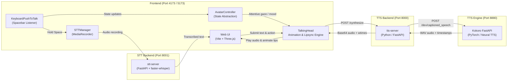

# Virtual Human - Local 3D Talking Avatar

A complete, self-hosted 3D virtual human application powered by **Three.js**, **TalkingHead**, **Kokoro TTS**, **faster-whisper STT**, and **Qwen3-8B** running locally on your GPU. It renders an interactive 3D avatar in the browser with real-time lip-synchronization, keyboard push-to-talk speech recognition, facial expressions, and full-body gestures.

---

## 🚀 Quick Start (One Command)

```powershell
# In the project root — starts llama.cpp + all Docker services
.\Start-VirtualHuman.ps1
```

Then open **http://localhost:4173** and hold `Space` to talk.

```powershell
# Stop everything
.\Start-VirtualHuman.ps1 -Stop

# Rebuild Docker images then start
.\Start-VirtualHuman.ps1 -Rebuild
```

> **First run?** Download the model first:
> ```powershell
> llama download --hf-repo Qwen/Qwen3-8B-GGUF --hf-file qwen3-8b-q4_k_m.gguf
> ```

---

## 🌟 Key Features

- **One-Command Launch**: `Start-VirtualHuman.ps1` starts llama.cpp (GPU) + all Docker services automatically.
- **Local Speech-to-Text (STT)**: Fast and private transcription powered by `faster-whisper` running locally on CPU or GPU.
- **Local LLM**: Qwen3-8B Q4_K_M via llama.cpp on RTX 4050 (Vulkan) — no cloud API, fully private.
- **Keyboard Push-to-Talk**: Hold <kbd>Space</kbd> to record speech, release to transcribe with visual state indicators and automatic input-field passthrough.
- **Real-Time 3D Rendering**: Built on Three.js and TalkingHead with full support for GLB/glTF avatar models, skeletal rigs, and morph targets.
- **Accurate Lip-Sync**: Timed phoneme and viseme matching powered by Kokoro's word-level timestamp generation.
- **Natural Gestures & Expressions**: Built-in support for idle breathing, blinking, head tracking, mood adjustments (happy/neutral), and animations (waving, dancing, posing, thumbs-up).
- **100% Local & Privacy-Friendly**: Runs entirely on your local machine without any cloud APIs or subscriptions.
- **Microservices Architecture**: Modular Docker stack dividing 3D rendering, speech synthesis, and audio transcription.

---

## 🏗️ Architecture




### Components

1. **`talking-avatar` (Frontend)**:
   - **Stack**: Vite, Three.js, TalkingHead library.
   - **Modules**:
     - `src/stt/STTManager.js`: Manages microphone capture, audio formats, track release, and API calls.
     - `src/stt/keyboardPushToTalk.js`: Spacebar push-to-talk handler, ignores auto-repeat, avoids page scrolling, and skips text inputs.
     - `src/avatar/AvatarController.js`: State manager decoupling application states (`idle`, `listening`, `speaking`, `thinking`) from TalkingHead.
   - **Port**: `4173` (Docker preview) or `5173` (Vite local dev).

2. **`stt-server` (Speech-to-Text Middleware)**:
   - **Stack**: Python 3.12, FastAPI, `faster-whisper`, FFmpeg.
   - **Role**: Receives audio uploads (WebM/Opus/WAV), runs local Whisper model inference, and returns text transcripts with language and duration.
   - **Port**: `8001`.

3. **`tts-server` (Text-to-Speech Middleware)**:
   - **Stack**: Python 3.12, FastAPI, Uvicorn, HTTPX.
   - **Role**: Validates requests, formats payloads for Kokoro, extracts and normalizes word start times and durations (in milliseconds).
   - **Port**: `8000`.

4. **`kokoro` (Speech Synthesis Engine)**:
   - **Image**: `ghcr.io/remsky/kokoro-fastapi-cpu:latest`.
   - **Role**: Fast CPU-based neural text-to-speech inference producing high-quality audio along with captioned speech timestamps.
   - **Port**: `8880`.

---

## 📂 Project Structure

```
virtual-human/
├── docker-compose.yml          # Multi-container orchestration (Kokoro, TTS, STT, Avatar)
├── .dockerignore               # Docker context ignore rules
├── Readme.md                   # Project documentation
│
├── stt-server/                 # Speech-to-Text service
│   ├── Dockerfile              # Python 3.12 container with ffmpeg
│   ├── requirements.txt        # faster-whisper, FastAPI, uvicorn, python-multipart
│   └── main.py                 # FastAPI service preloading Whisper model
│
├── talking-avatar/             # Frontend application
│   ├── Dockerfile              # Production Node/Vite container
│   ├── vite.config.js          # Vite config with API proxy for /api/tts & /api/stt
│   ├── package.json            # NPM dependencies (Three.js, Vite)
│   ├── index.html              # UI layout, transcript box & PTT banner
│   ├── public/
│   │   ├── avatars/            # 3D GLB Models (brunette.glb, avaturn.glb, etc.)
│   │   ├── animations/         # FBX animations (walking.fbx, etc.)
│   │   └── poses/              # Custom poses (dance.fbx, etc.)
│   └── src/
│       ├── main.js             # Bootstrap, UI controls & event binding
│       ├── avatar/
│       │   └── AvatarController.js # Avatar state abstraction (listening, idle, etc.)
│       ├── stt/
│       │   ├── STTManager.js       # Audio recording & transcription manager
│       │   └── keyboardPushToTalk.js # Spacebar push-to-talk handler
│       └── talkinghead/        # TalkingHead library and lip-sync modules
│
└── tts-server/                 # Text-to-Speech service
    ├── Dockerfile              # Python 3.12 container
    └── main.py                 # FastAPI service bridging avatar to Kokoro
```

---

## 🚀 Quick Start (Docker Compose)

### Prerequisites

- [Docker Desktop](https://www.docker.com/products/docker-desktop/) installed and running.
- WSL2 backend enabled (on Windows).

### 1. Start all services

Run from the root directory:

```bash
docker compose up --build -d
```

### 2. Access the Application

Once the containers are up, open your browser:

| Service | URL | Description |
|---|---|---|
| **Avatar Web UI** | [http://localhost:4173](http://localhost:4173) | Main 3D avatar interface with STT & TTS |
| **STT Server API Docs** | [http://localhost:8001/docs](http://localhost:8001/docs) | Swagger UI for speech-to-text service |
| **TTS Server API Docs** | [http://localhost:8000/docs](http://localhost:8000/docs) | Swagger UI for speech synthesis middleware |
| **Kokoro Engine Docs** | [http://localhost:8880/docs](http://localhost:8880/docs) | Swagger UI for Kokoro TTS engine |

### 3. Container Management

```bash
# Check status of all containers
docker compose ps

# View live logs for STT service
docker compose logs -f stt-server

# Stop all containers
docker compose down
```

---

## 🎤 How to Use Push-to-Talk (STT)

1. Click on the 3D avatar window to ensure the browser has focus.
2. **Press and hold the <kbd>Space</kbd> key**:
   - The indicator will show `🔴 LISTENING... Release SPACE when finished`.
   - The avatar enters the attentive `listening` state.
3. **Speak into your microphone**: (e.g., *"Hello! Can you help me?"*).
4. **Release <kbd>Space</kbd>**:
   - Recording stops immediately and releases microphone tracks.
   - The indicator transitions to `⏳ TRANSCRIBING...`.
   - faster-whisper transcribes your voice locally.
   - The transcript is displayed under **Conversation**:
     ```text
     You said:
     "Hello! Can you help me?"
     ```
5. **Typing in Text Inputs**:
   - If you click inside the text input box, pressing <kbd>Space</kbd> enters a normal space character without triggering speech recognition.

---

## ⚙️ STT Configuration (Environment Variables)

Configure the Whisper model in `docker-compose.yml` or through environment variables:

| Variable | Default | Description |
|---|---|---|
| `WHISPER_MODEL` | `base` | Model size: `tiny`, `base`, `small`, `medium`, `large-v3` |
| `WHISPER_DEVICE` | `cpu` | Inference device: `cpu` or `cuda` |
| `WHISPER_COMPUTE_TYPE` | `int8` | Precision: `int8`, `float32`, or `float16` (for GPU) |

---

## 📡 API Reference

### 1. STT Service (`stt-server`)

#### `GET /health`
Returns service status and engine metadata:
```json
{
  "status": "ok",
  "service": "stt-server",
  "model": "faster-whisper"
}
```

#### `POST /transcribe`
Accepts `multipart/form-data` with an `audio` file (`.webm`, `.wav`, `.ogg`):
```bash
curl -X POST "http://localhost:8001/transcribe" \
     -F "audio=@recording.webm"
```
**Response**:
```json
{
  "text": "Hello world, this is a test.",
  "language": "en",
  "duration": 2.41
}
```

### 2. TTS Service (`tts-server`)

#### `POST /synthesize`
Generates base64 WAV audio and word-level timing markers for TalkingHead.
```json
{
  "text": "Hello! I am your virtual human.",
  "voice": "af_bella",
  "speed": 1.0
}
```

---

## ❓ Troubleshooting

| Issue | Cause | Solution |
|---|---|---|
| **"Microphone permission is required"** | Browser blocked microphone access | Allow microphone permissions in your browser URL bar. |
| **"Speech recognition service is unavailable"** | `stt-server` container is stopped | Run `docker compose up -d stt-server` and verify port 8001. |
| **Spacebar scrolls the page** | Push-to-talk handler not focused | Click anywhere on the avatar canvas to focus the window. |
| **"No speech detected"** | Spacebar pressed too briefly or silent input | Hold Spacebar firmly while speaking clearly, then release. |
| **"The local LLM is not running"** | llama.cpp not started on Windows host | Follow the LOCAL LLM SETUP section below. |
| **LLM takes >2 minutes to respond** | Model too large for available VRAM | Ensure Vulkan0 (RTX 4050) is selected, not Vulkan1 (Intel). |

---

## 🧠 LOCAL LLM SETUP

The LLM runs **directly on your Windows host** (not in Docker) so it can access the RTX 4050 Laptop GPU via Vulkan.

> **Hardware:** Windows 11 · NVIDIA RTX 4050 Laptop GPU (6 GB VRAM) · 16 GB RAM  
> **LLM Runtime:** llama.cpp 0.5.0-dev Build 11149 (Clang 20, Windows x86_64)  
> **Model:** Qwen3-8B Q4_K_M (~4.9 GB)

### Step 1 — Download the model

```powershell
llama download --hf-repo Qwen/Qwen3-8B-GGUF --hf-file qwen3-8b-q4_k_m.gguf
```

The model file is saved to the llama.cpp model cache (typically `%USERPROFILE%\.llama\models`).

### Step 2 — Start llama.cpp server

Open a **PowerShell terminal** (separate from Docker) and run:

```powershell
llama serve `
  --hf-repo  Qwen/Qwen3-8B-GGUF `
  --hf-file  qwen3-8b-q4_k_m.gguf `
  --device   Vulkan0 `
  --gpu-layers 99 `
  --ctx-size 2048 `
  --parallel 1 `
  --host     0.0.0.0 `
  --port     8080 `
  --reasoning off
```

> **Important:** `--device Vulkan0` = NVIDIA RTX 4050. `Vulkan1` = Intel GPU — do **not** use that.

### Step 3 — Verify it is running

```powershell
Invoke-RestMethod http://localhost:8080/health
```

Expected: `{"status":"ok"}` or `{"status":"loading model"}`.

You can also check from the Docker side via the tts-server health endpoint:

```powershell
Invoke-RestMethod http://localhost:8000/llm/health
```

Expected:

```json
{
  "available": true,
  "enabled": true,
  "base_url": "http://host.docker.internal:8080",
  "model": "Qwen3-8B-Q4_K_M"
}
```

### Step 4 — Start the Docker stack

```powershell
docker compose up -d
```

### Full Pipeline After Setup

```text
Hold SPACE → speak → release SPACE
        ↓
  faster-whisper (Docker, port 8001)
        ↓
   transcript text
        ↓
  tts-server /chat (Docker, port 8000)
        ↓
  llama.cpp /v1/chat/completions (Windows host, port 8080)
        ↓
  Qwen3-8B on RTX 4050 (Vulkan0)
        ↓
   LLM reply displayed in browser
```

### Environment Variables (docker-compose.yml)

| Variable | Default | Description |
|---|---|---|
| `LLM_ENABLED` | `true` | Enable/disable LLM integration |
| `LLM_BASE_URL` | `http://host.docker.internal:8080` | llama.cpp server URL (from Docker) |
| `LLM_MODEL` | `Qwen3-8B-Q4_K_M` | Model name sent in API requests |
| `LLM_TEMPERATURE` | `0.7` | Sampling temperature |
| `LLM_MAX_TOKENS` | `256` | Max reply length in tokens |
| `LLM_TIMEOUT` | `120` | HTTP read timeout (seconds) |
| `LLM_HISTORY_TURNS` | `8` | Rolling conversation turns to keep |
